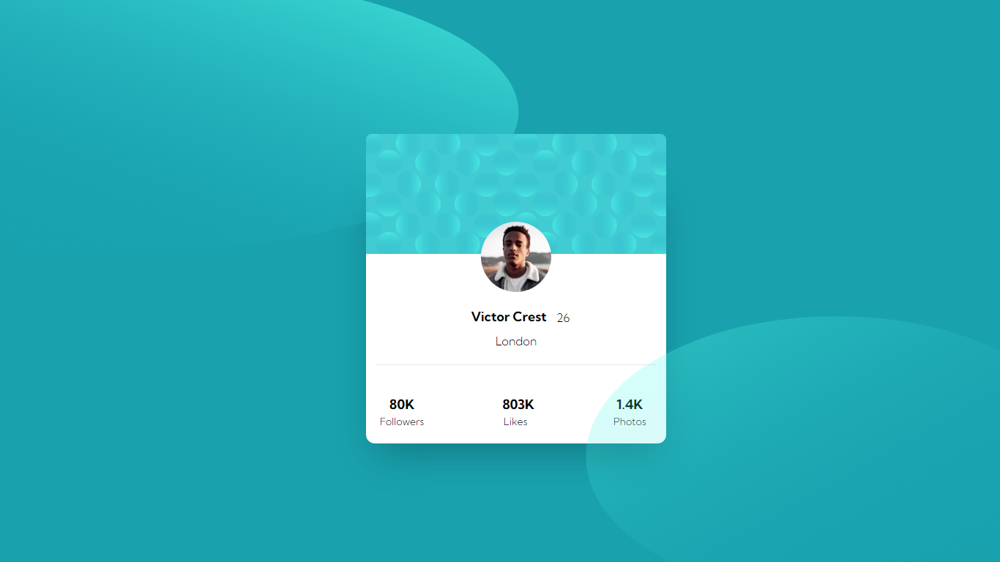

<h1>Profile card component solution</h1>

This is my solution to the [Profile card component challenge on Frontend Mentor](https://www.frontendmentor.io/challenges/profile-card-component-cfArpWshJ). 

</img>

- Solution URL: [Frontend Mentor]()
- Live Site URL: [GitHub](https://kalebemax.github.io/profile-card-component-main/)

<h2>Built with</h2>

- Semantic HTML5 markup
- CSS custom properties
- Tailwind Css
- Flexbox
- Mobile-first workflow
